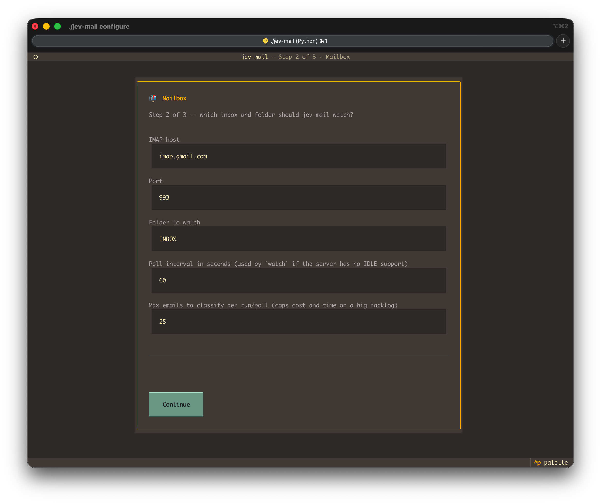
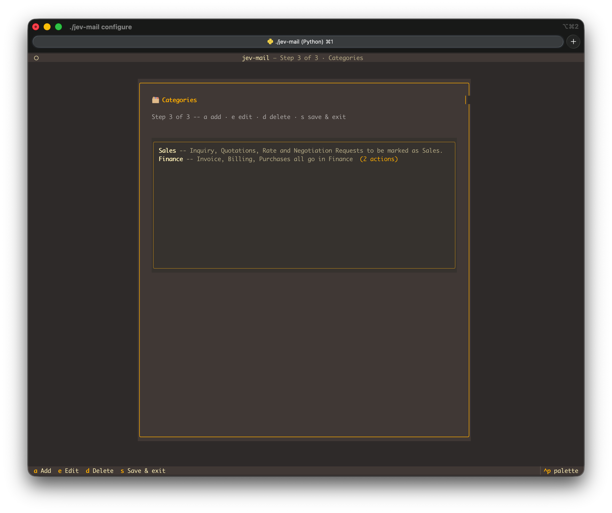

<div align="center">

```
     ██╗███████╗██╗   ██╗    ███╗   ███╗ █████╗ ██╗██╗
     ██║██╔════╝██║   ██║    ████╗ ████║██╔══██╗██║██║
     ██║█████╗  ██║   ██║    ██╔████╔██║███████║██║██║
██   ██║██╔══╝  ╚██╗ ██╔╝    ██║╚██╔╝██║██╔══██║██║██║
╚█████╔╝███████╗ ╚████╔╝     ██║ ╚═╝ ██║██║  ██║██║███████╗
 ╚════╝ ╚══════╝  ╚═══╝      ╚═╝     ╚═╝╚═╝  ╚═╝╚═╝╚══════╝
```

**Your inbox, judged in milliseconds.**

[](https://www.python.org/)
[](LICENSE)
[](https://typesafe.ai)
[](https://github.com/textualize/textual)

*Classify, tag, and move email with Jev.*

https://github.com/user-attachments/assets/4604d2ff-6e59-4938-983e-305d355be5d2

</div>

---

## Why

Classifying email with a normal LLM means writing a prompt, hoping it returns valid
JSON, and paying full chat-completion prices for what is really just "does this apply:
yes or no." [Jev](https://typesafe.ai), TypeSafe's **System One model**, skips all of
that: you send it your inbox state and a set of yes/no questions, and it hands back
calibrated probabilities directly -- typically in well under a second, for a fraction of
a cent per email.

### What makes Jev different from calling an LLM

Chat LLMs are trained with RLHF to produce fluent, human-pleasing *text* -- great for
conversation, but that same optimization is what makes them mode-drop, hedge, and
overstate confidence when what you actually need is a reliable decision buried inside
software. Jev is TypeSafe's first **System One model**: instead of generating a
sentence you have to parse, it's trained with **Reinforcement Learning for Calibrated
Decisions (RLCD)** to output typed, calibrated probabilities directly -- "more like
code: reliable, fast, self-consistent, and type-safe" than like a chatbot reply.

That shows up as a very different cost and latency profile for exactly the kind of
question `jev-mail-classifier` asks per email ("is this an invoice, yes or no"):

- **~193x faster** than a general-purpose LLM on this class of task
- **~238x cheaper** per token than Claude ($42 per billion input tokens)
- In TypeSafe's own benchmark, an equivalent workflow ran in **0.114s for $0.000081**
  on Jev vs. **8.566s for $0.014** on an LLM

Because the output is a calibrated probability rather than free text, you also get a
knob a chat completion doesn't give you for free: a **threshold per category**. Set
`urgent` to fire at `0.7` and `spam` at `0.9`, and Jev's own confidence -- not a second
prompt asking "are you sure?" -- decides whether an action runs.

**jev-mail-classifier** wraps that in something you can actually run against a real
mailbox: connect over IMAP, define categories in plain language, and let each category
tag or move messages. Configure it through the terminal UI.

## Quickstart

```bash
git clone https://github.com/parth-kp/jev-mail-classifier
cd jev-mail-classifier
./install.sh
```

That's it -- `install.sh` sets up a virtualenv, installs the package, and drops you
straight into the setup wizard. Enter a TypeSafe or OpenRouter API key and your
IMAP login, then add categories.

Once configured, run it with `./jev-mail` from inside the project directory --
`install.sh` installs into a local `.venv`, and `./jev-mail` is a small wrapper that
finds it for you, so there's no venv to activate and nothing to add to your shell PATH:

```bash
./jev-mail run             # classify unprocessed mail once, then exit (cron-friendly)
./jev-mail run --dry-run   # see what WOULD happen, without touching your mailbox
./jev-mail watch           # keep classifying new mail as it arrives (IMAP IDLE)
./jev-mail configure       # reopen the TUI to add/edit categories or credentials any time
```

Re-running `./install.sh` later is safe -- it won't ask for your key/login again if
`config.yaml` already exists, and the credentials screen always shows what's already
saved (masked) rather than blank fields.

> **Coming soon:** `pipx install jev-mail-classifier` -- for now, `install.sh` after
> cloning is the whole setup.

## What it looks like

`jev-mail configure` is a three-step terminal UI:

1. **Credentials** -- paste your Jev key and IMAP login (masked input, written straight
   to a git-ignored `.env` -- you never hand-edit a config file for secrets)
2. **Mailbox** -- host, port, folder to watch, poll interval
3. **Categories** -- a live list you manage with single keystrokes:
   `a` add &middot; `e` edit &middot; `d` delete &middot; `s` save & exit

<p align="center">
  
</p>
<p align="center">
  
</p>

Each category has a description and actions to tag or move matching messages.

## How it works

```
   IMAP inbox                    Jev                      your mailbox
 ┌──────────────┐   subject+body   ┌───────────┐   probabilities   ┌──────────────┐
 │  unprocessed │ ───────────────► │  one call, │ ────────────────► │ tag / move   │
 │    email     │                  │ one yes/no │                    │              │
 │              │ ◄─────────────── │  question  │ ◄──────────────── │              │
 └──────────────┘   marked          │ per category│    threshold      └──────────────┘
                     processed       └───────────┘     per category
```

Every configured category becomes one independent yes/no question in a **single** Jev
call per email (multi-label: an email can match several categories at once). Each
category's probability is checked against its threshold, and every action attached to a
matching category runs. Processed mail is marked with a private IMAP keyword
(`$JevProcessed`) -- no separate database to keep in sync.

## Config, if you'd rather skip the TUI

`config.yaml` (see [`config.example.yaml`](config.example.yaml)) is plain and hand-editable:

```yaml
categories:
  invoice:
    description: "Invoice, billing statement, or payment request"
    actions:
      - type: tag
        value: Invoice
      - type: move
        folder: Invoices

  urgent:
    description: "Time-sensitive, needs action today"
    threshold: 0.7
    actions:
      - type: tag
        value: Urgent
```

`mailbox.max_emails_per_run` (default `25`) caps how many unprocessed emails get
classified in a single `run` or poll cycle -- protects against a huge backlog burning
through your Jev quota or a run taking forever the first time you point this at a real
inbox. If a run hits the cap, it prints a notice and picks up the rest next time.
"Unprocessed" means missing the `$JevProcessed` keyword, not `\Seen`/unread -- opening
an email doesn't skip it. When capped, the newest unprocessed mail is classified first.

| Action        | What it does                                   |
| ------------- | ----------------------------------------------- |
| `tag`         | Adds a custom IMAP keyword to the message        |
| `move`        | Moves the message to another folder (creates it if missing) |

## Two ways to power it

Set **one** of these in `.env` (the wizard writes it for you) -- checked in this order:

| Priority | Env var               | Backend                                   |
| -------- | ---------------------- | ------------------------------------------ |
| 1        | `TYPESAFE_API_KEY`     | TypeSafe's own API, direct                  |
| 2        | `OPENROUTER_API_KEY`   | Via OpenRouter's Decisions endpoint         |

Or set `jev.provider` in `config.yaml` to pin one explicitly instead of auto-detecting.

> The OpenRouter adapter has been tested with a live key. The TypeSafe adapter
> follows its published docs but has not been tested with a live key.

## Development

```bash
python3 -m venv .venv && .venv/bin/pip install -e ".[dev]"
.venv/bin/pytest
```

## License

MIT -- see [LICENSE](LICENSE).
