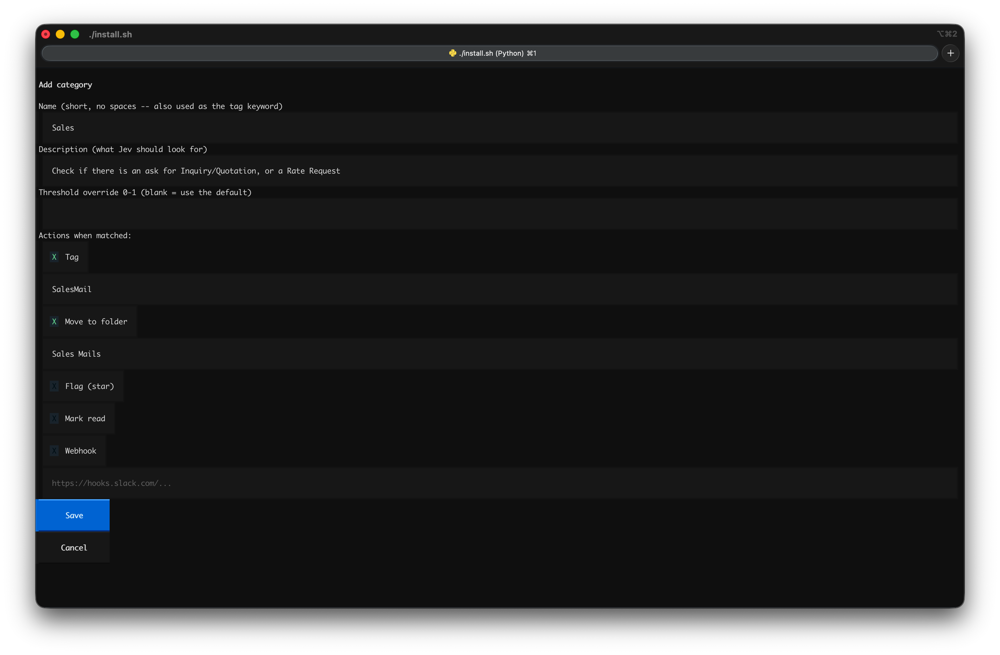
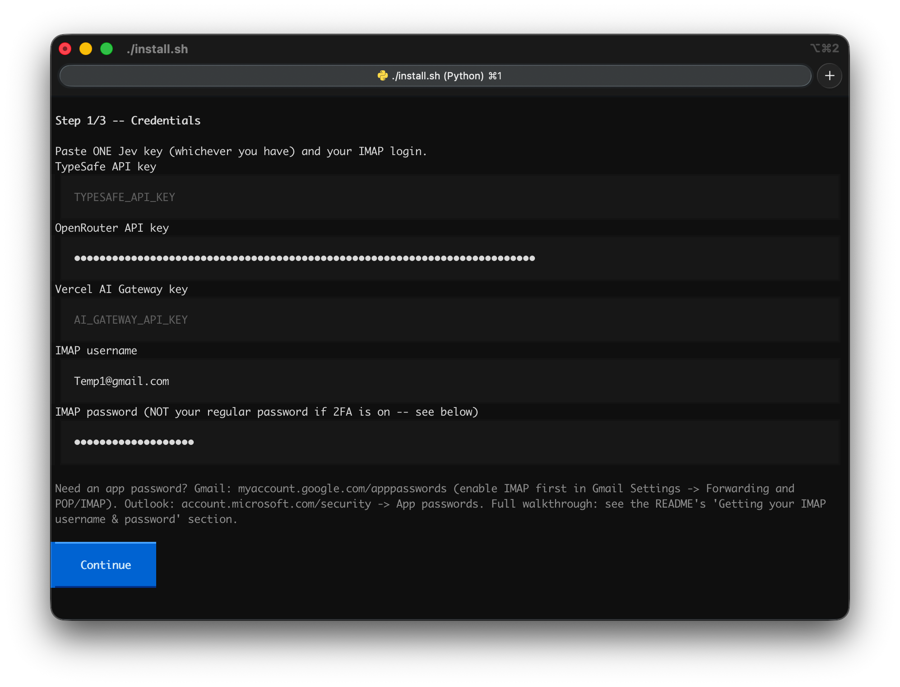

<div align="center">

```
     ██╗███████╗██╗   ██╗    ███╗   ███╗ █████╗ ██╗██╗
     ██║██╔════╝██║   ██║    ████╗ ████║██╔══██╗██║██║
     ██║█████╗  ██║   ██║    ██╔████╔██║███████║██║██║
██   ██║██╔══╝  ╚██╗ ██╔╝    ██║╚██╔╝██║██╔══██║██║██║
╚█████╔╝███████╗ ╚████╔╝     ██║ ╚═╝ ██║██║  ██║██║███████╗
 ╚════╝ ╚══════╝  ╚═══╝      ╚═╝     ╚═╝╚═╝  ╚═╝╚═╝╚══════╝
```

**Your inbox, judged in milliseconds.**

[](https://www.python.org/)
[](LICENSE)
[](https://typesafe.ai)
[](https://github.com/textualize/textual)

*Tag, move, flag, and notify -- no LLM prompt engineering, no JSON parsing, no per-email API bill that adds up.*

[](media/brag.mp4)

*(GIF preview above -- [watch the full clip with sound](media/brag.mp4))*

</div>

---

## Why

Classifying email with a normal LLM means writing a prompt, hoping it returns valid
JSON, and paying full chat-completion prices for what is really just "does this apply:
yes or no." [Jev](https://typesafe.ai), TypeSafe's **System One model**, skips all of
that: you send it your inbox state and a set of yes/no questions, and it hands back
calibrated probabilities directly -- typically in well under a second, for a fraction of
a cent per email.

**jev-mail-classifier** wraps that in something you can actually run against a real
mailbox: connect over IMAP, define categories in plain language, and let each category
tag, move, flag, or ping a webhook -- all from a terminal UI, no code required.

## Quickstart

```bash
git clone https://github.com/parth-kp/jev-mail-classifier
cd jev-mail-classifier
./install.sh
```

That's it -- `install.sh` sets up a virtualenv, installs the package, and drops you
straight into the setup wizard. Paste **one** Jev API key (TypeSafe, OpenRouter, or
Vercel AI Gateway -- whichever you have), your IMAP login, and start adding categories.

Once configured, run it with `./jev-mail` from inside the project directory --
`install.sh` installs into a local `.venv`, and `./jev-mail` is a small wrapper that
finds it for you, so there's no venv to activate and nothing to add to your shell PATH:

```bash
./jev-mail run             # classify unprocessed mail once, then exit (cron-friendly)
./jev-mail run --dry-run   # see what WOULD happen, without touching your mailbox
./jev-mail watch           # keep classifying new mail as it arrives (IMAP IDLE)
./jev-mail configure       # reopen the TUI to add/edit categories or credentials any time
```

Re-running `./install.sh` later is safe -- it won't ask for your key/login again if
`config.yaml` already exists, and the credentials screen always shows what's already
saved (masked) rather than blank fields.

> **Coming soon:** `pipx install jev-mail-classifier` -- for now, `install.sh` after
> cloning is the whole setup.

## Getting your IMAP username & password

The wizard asks for these on the first screen. "Username" is just your email address;
"password" is where people get stuck, because **if your account has 2-factor
authentication on, your normal login password will not work over IMAP** -- you need a
separate *app password* instead.

**Gmail**
1. Turn on IMAP: Gmail Settings (gear icon) -> **See all settings** -> **Forwarding and
   POP/IMAP** tab -> enable IMAP -> Save.
2. Create an app password: go to [myaccount.google.com/apppasswords](https://myaccount.google.com/apppasswords)
   (requires 2-Step Verification to be on -- turn it on first if it isn't). Name it
   anything (e.g. "jev-mail"), copy the 16-character password it gives you.
3. Use your full Gmail address as the username, and that 16-character code as the
   password. Host: `imap.gmail.com`, port `993`.

**Outlook / Microsoft 365**
1. Go to [account.microsoft.com/security](https://account.microsoft.com/security) ->
   **Advanced security options** -> **App passwords** -> create one.
2. Username is your full email address, password is the app password. Host:
   `outlook.office365.com`, port `993`.

**Yahoo Mail**
1. Account Info -> **Account Security** -> turn on 2-step verification -> **Generate
   app password**. Host: `imap.mail.yahoo.com`, port `993`.

**Any other provider**
Look for "IMAP settings" in your provider's account/security settings -- you need the
IMAP host and port (almost always `993`), and, if 2FA is on, an app-specific password
generated the same way. If 2FA is off, your regular email password usually works, but
an app password is safer since it can be revoked without changing your main password.

## What it looks like

`jev-mail configure` is a three-step terminal UI:

1. **Credentials** -- paste your Jev key and IMAP login (masked input, written straight
   to a git-ignored `.env` -- you never hand-edit a config file for secrets)
2. **Mailbox** -- host, port, folder to watch, poll interval
3. **Categories** -- a live list you manage with single keystrokes:
   `a` add &middot; `e` edit &middot; `d` delete &middot; `s` save & exit

<p align="center">
  
  
</p>

Each category is a plain-language description plus a checklist of actions -- tag, move,
flag, mark read, or hit a webhook -- no YAML syntax to remember.

## How it works

```
   IMAP inbox                    Jev                      your mailbox
 ┌──────────────┐   subject+body   ┌───────────┐   probabilities   ┌──────────────┐
 │  unprocessed │ ───────────────► │  one call, │ ────────────────► │ tag / move / │
 │    email     │                  │ one yes/no │                    │ flag / hook  │
 │              │ ◄─────────────── │  question  │ ◄──────────────── │              │
 └──────────────┘   marked          │ per category│    threshold      └──────────────┘
                     processed       └───────────┘     per category
```

Every configured category becomes one independent yes/no question in a **single** Jev
call per email (multi-label: an email can match several categories at once). Each
category's probability is checked against its threshold, and every action attached to a
matching category runs. Processed mail is marked with a private IMAP keyword
(`$JevProcessed`) -- no separate database to keep in sync.

## Config, if you'd rather skip the TUI

`config.yaml` (see [`config.example.yaml`](config.example.yaml)) is plain and hand-editable:

```yaml
categories:
  invoice:
    description: "Invoice, billing statement, or payment request"
    actions:
      - type: tag
        value: Invoice
      - type: move
        folder: Invoices

  urgent:
    description: "Time-sensitive, needs action today"
    threshold: 0.7
    actions:
      - type: flag
      - type: webhook
        url: ${SLACK_WEBHOOK_URL}
```

`mailbox.max_emails_per_run` (default `25`) caps how many unprocessed emails get
classified in a single `run` or poll cycle -- protects against a huge backlog burning
through your Jev quota or a run taking forever the first time you point this at a real
inbox. If a run hits the cap, it prints a notice and picks up the rest next time.

| Action        | What it does                                   |
| ------------- | ----------------------------------------------- |
| `tag`         | Adds a custom IMAP keyword to the message        |
| `move`        | Moves the message to another folder (creates it if missing) |
| `flag`        | Sets the `\Flagged` (star) system flag           |
| `unflag`      | Clears it                                        |
| `mark_read`   | Sets `\Seen`                                     |
| `mark_unread` | Clears it                                        |
| `webhook`     | `POST`s `{category, probability, subject}` to a URL |

## Three ways to power it

Set **one** of these in `.env` (the wizard writes it for you) -- checked in this order:

| Priority | Env var               | Backend                                   |
| -------- | ---------------------- | ------------------------------------------ |
| 1        | `TYPESAFE_API_KEY`     | TypeSafe's own API, direct                  |
| 2        | `OPENROUTER_API_KEY`   | Via OpenRouter's Decisions endpoint         |
| 3        | `AI_GATEWAY_API_KEY`   | Via Vercel AI Gateway                       |

Or set `jev.provider` in `config.yaml` to pin one explicitly instead of auto-detecting.

> The OpenRouter path is live-verified. The TypeSafe-direct and Vercel-gateway adapters
> are built from their published docs but not yet tested against a live key -- if one of
> those breaks for you, `jev_mail/providers/` is the one place to look, and pull
> requests are very welcome.

## Development

```bash
python3 -m venv .venv && .venv/bin/pip install -e ".[dev]"
.venv/bin/pytest
```

## License

MIT -- see [LICENSE](LICENSE).
